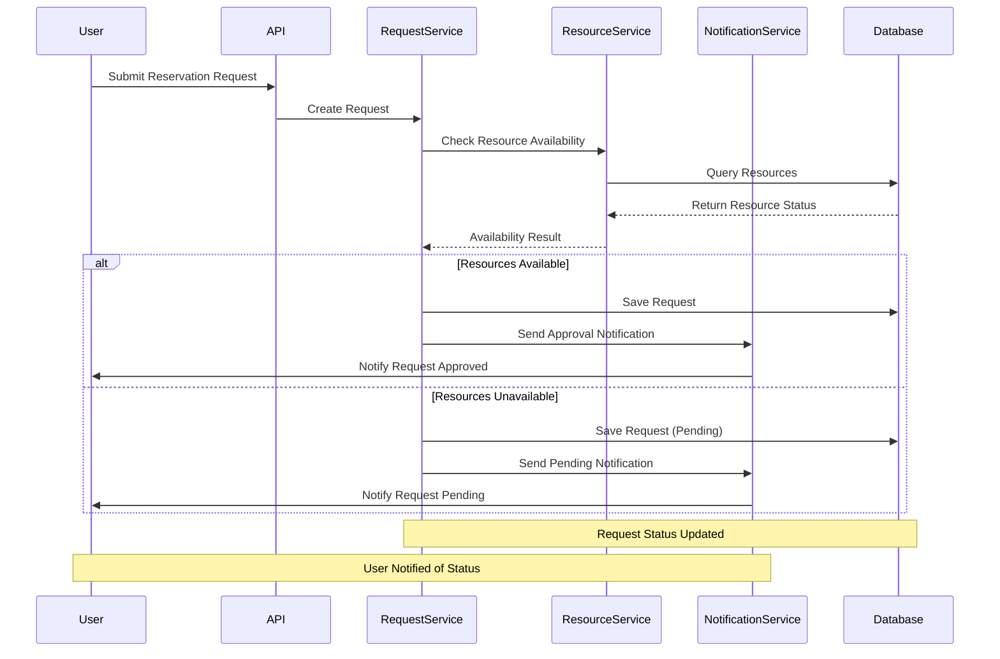

# Resource Reservation System

## Overview
This is a .NET 8.0 web application that implements a resource reservation system. The system allows users to manage and reserve various types of resources, track requests, and receive notifications about resource availability and reservation status.



## Process Description

1. **Request Submission**
   - User submits a reservation request through the API
   - Request includes resources, time period, and optional reason

2. **Resource Availability Check**
   - System checks if requested resources are available
   - Verifies no conflicts with existing reservations

3. **Request Processing**
   - If resources are available:
     - Request is approved
     - Resources are reserved
     - User is notified of approval
   - If resources are unavailable:
     - Request is marked as pending
     - User is notified of pending status

4. **Notification**
   - System sends appropriate notifications based on request status
   - Notifications include request details and next steps

5. **Status Updates**
   - Request status is tracked in the database
   - Users can check request status at any time 

## Architecture
The application follows a layered architecture with the following components:

### Models
- `Resource`: Represents a reservable resource with properties like name, type, and availability
- `ResourceType`: Defines different categories of resources
- `ResourceGroup`: Groups related resources together
- `Request`: Represents a reservation request
- `RequestStatus`: Tracks the state of a reservation request
- `Notification`: Handles system notifications
- `LogRecord`: Records system activities and changes

### Controllers
- `ResourcesController`: Manages resource operations
- `ResourceGroupsController`: Handles resource group management
- `ResourcesTypesController`: Manages resource type definitions
- `RequestsController`: Processes reservation requests
- `NotificationController`: Handles notification delivery
- `LogRecordsController`: Manages system logs

### Services
- `ResourceService`: Business logic for resource management
- `ResourceGroupService`: Handles resource group operations
- `ResourceTypeService`: Manages resource type definitions
- `RequestService`: Processes reservation requests
- `NotificationService`: Handles notification delivery
- `LogRecordService`: Manages system logging

### Background Services
- `BackgroundService`: Handles asynchronous tasks and scheduled operations

## Database
The application uses SQLite as its database, managed through Entity Framework Core.

## Features
1. Resource Management
   - Create, read, update, and delete resources
   - Group resources by type and category
   - Track resource availability

2. Reservation System
   - Submit and manage reservation requests
   - Track request status
   - Handle resource conflicts

3. Notification System
   - Send notifications about reservation status
   - Alert users about resource availability

4. Logging
   - Track system activities
   - Monitor changes to resources and reservations

## Setup Instructions
1. Clone the repository
2. Install .NET 8.0 SDK
3. Restore NuGet packages
4. Update database:
   ```bash
   dotnet ef database update
   ```
5. Run the application:
   ```bash
   dotnet run
   ```

## API Documentation
The application includes Swagger documentation available at `/swagger` when running in development mode.

## Process Flow
1. User submits a reservation request for a specific resource
2. System validates the request and checks resource availability
3. If available, the request is approved and the resource is reserved
4. If not available, the request is queued or rejected
5. Notifications are sent to relevant users about the request status
6. All actions are logged for auditing purposes

## Dependencies
- Microsoft.EntityFrameworkCore.Sqlite
- Swashbuckle.AspNetCore (for API documentation)
- System.Text.Json
